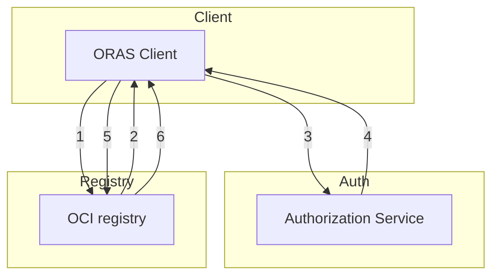

# ORAS Authentication Model

## Abstract

This design document outlines the initial approach for implementing bearer token authentication in ORAS, as well as the authentication workflow between the registry and the authorization server. Bearer token authentication is preferred over basic authentication because it offers better security, scalability, and flexibility, allowing for smoother integration with modern authentication protocols and reducing the risk of exposing sensitive credentials. Supporting bearer token authentication aligns with OAuth2 standards, which are widely adopted by modern registries, providing a secure and efficient way to authenticate users and manage access.

## Introduction

Currently, the ORAS .NET SDK does not fully implement an authentication model for registries. This design document outlines the high-level design for implementing bearer token Authentication, enabling support for secure user authentication, and detailing the authentication workflow between the registry and the authorization server.


## Design

### The high level auth client design is as follows:

```mermaid
  erDiagram
    Client {
        boolean ForceAttemptOAuth2
        string ClientId
        Cache Cache
        CredentialFunc(string registry) => Credential
    }

    Credential {
        string username
        string password
        string refreshtoken
        string accessToken
    }

    Cache {
        Dictionary tokenCache
        Dictionary SchemesCache
    }

    Client ||--o| Credential : contains
    Client ||--o| Cache : contains
    
    Client ||--o| SendAsync : overrides
    Client ||--o| FetchBasicAuth : method
    Client ||--o| FetchBearerAuth : method
```

### The Authentication workflow is as follows:



1. ORAS client attempts to begin a push/pull operation with the registry.
2. If the registry requires authorization, it will return a 401 Unauthorized HTTP response with information, i.e. Www-Authenticate header, on how to authenticate
3. The ORAS client makes a request to the authorization service for a Bearer token.
4. The authorization service returns an opaque Bearer token representing the client’s authorized access.
5. The ORAS client retries the original request with the Bearer token embedded in the request’s Authorization header.
6. The Registry authorizes the client by validating the Bearer token and the claim set embedded within it and begins the push/pull session as usual.


#### Note:
The current .NET SDK does not provide a public method to obtain a refresh token from the client. One solution could be to introduce a separate package dedicated to handling platform-specific tasks, such as those required for Azure Container Registry (ACR).
