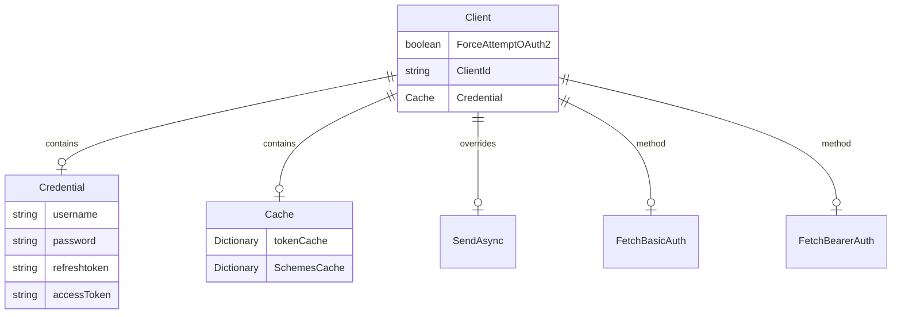
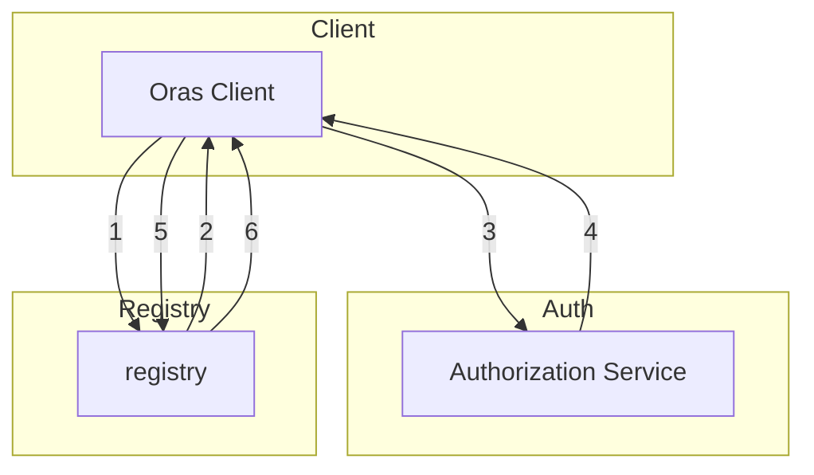

# Oras Authentication Model

## Abstract

This design document outlines the initial design of the bearer token authentication model in Oras, as well as the authentication workflow between the registry and the authorization server.

## Introduction

Currently, the Oras .NET SDK does not fully implement an authentication model for registries. This design document outlines the plan to complete the authentication model by implementing Bearer Authentication, enabling support for bearer token authentication, and detailing the authentication workflow between the registry and the authorization server.

## Design

### The high level auth client design is as follows:

### The Authentication workflow is as follows:

1. Oras client attempts to begin a push/pull operation with the registry.
2. If the registry requires authorization, it will return a 401 Unauthorized HTTP response with information, i.e. Www-Authenticate header, on how to authenticate
3. The Oras client makes a request to the authorization service for a Bearer token.
4. The authorization service returns an opaque Bearer token representing the client’s authorized access.
5. The Oras client retries the original request with the Bearer token embedded in the request’s Authorization header.
6. The Registry authorizes the client by validating the Bearer token and the claim set embedded within it and begins the push/pull session as usual.

#### Note: 
  The current Azure ACR .NET SDK does not provide a public method to obtain an ACR refresh token from the Azure client. I have already reached out to the relevant stakeholders to explore any potential workarounds for this limitation. Alternatively, another solution could be to introduce a separate package dedicated to handling Azure-specific tasks.
