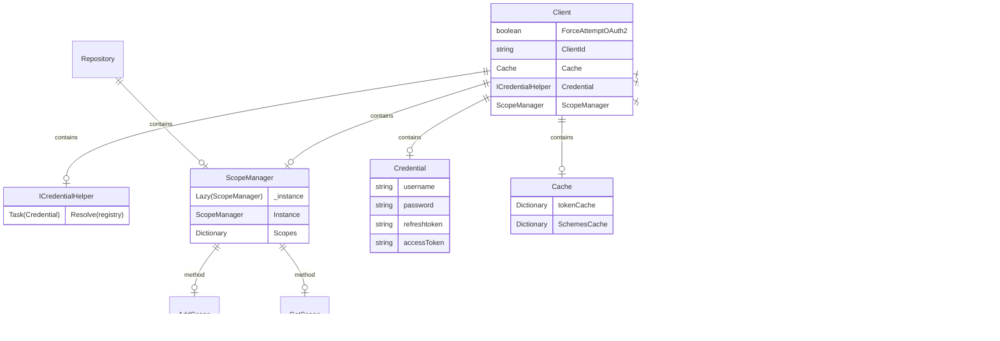

# ORAS Authentication Model

## Abstract

This design document outlines the initial approach for implementing bearer token authentication in ORAS, as well as the authentication workflow between the registry and the authorization server. Bearer token authentication is preferred over basic authentication because it offers better security, scalability, and flexibility, allowing for smoother integration with modern authentication protocols and reducing the risk of exposing sensitive credentials. Supporting bearer token authentication aligns with OAuth2 standards, which are widely adopted by modern registries, providing a secure and efficient way to authenticate users and manage access.

## Introduction

Currently, the ORAS .NET SDK does not fully implement an authentication model for registries. This design document outlines the high-level design for implementing bearer token Authentication, enabling support for secure user authentication, and detailing the authentication workflow between the registry and the authorization server.

## Design

### The high level auth client design is as follows:

In this design, the Client class is structured with several key variables: ForceAttemptOAuth2, ClientId, Cache, Credential, and ScopeManager.

Cache: This component is responsible for storing the access token retrieved from the authorization server, specifically for each repository, to optimize repeated token requests.

Credential: The Credential variable leverages an interface that provides a Resolve method to retrieve credentials. Users can implement concrete credential retrieval logic based on different cloud providers, ensuring flexibility and extensibility.

ScopeManager: This service is responsible for managing scopes across the entire application context per repository. It follows the Singleton pattern to ensure a single, thread-safe instance is used throughout the application.

ForceAttemptOAuth2: This variable acts as a toggle to enable or disable OAuth2 authentication, giving the user control over the authentication method.

ClientId: The ClientId is the identifier used when sending requests to the registries.

ICredentialHelper is an interface that defines a Resolve method, which must be implemented by the user. This approach provides flexibility and extendability, allowing for seamless integration with different cloud providers.

ScopeManager is a service responsible for managing scopes across the entire application context. It employs the Singleton pattern, utilizing the Lazy<T> class to ensure that only a single instance is created. This approach guarantees thread-safety and supports lazy loading, initializing the instance only when it is first needed.

### The Authentication workflow is as follows:

1. ORAS client attempts to begin a push/pull operation with the registry.
2. If the registry requires authorization, it will return a 401 Unauthorized HTTP response with information, i.e. Www-Authenticate header, on how to authenticate
3. The ORAS client makes a request to the authorization service for a Bearer token.
4. The authorization service returns an opaque Bearer token representing the client’s authorized access.
5. The ORAS client retries the original request with the Bearer token embedded in the request’s Authorization header.
6. The Registry authorizes the client by validating the Bearer token and the claim set embedded within it and begins the push/pull session as usual.
